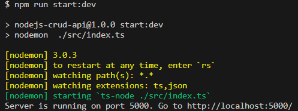
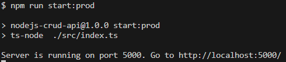
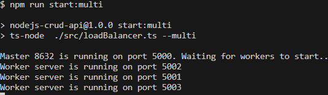

# CRUD API

### To test app you need:

- Clone git repository

```
git clone https://github.com/victordobryi/nodejs-crud-api.git

```

- Change the branch to develop

```
git checkout develop
```

- Install dependencies

```
npm i
```

- Run app (in developer mod)

```
npm run start:dev
```



- or run app (in production mod)

```
npm run start:prod
```



- or run app (in multi mod)

```
npm run start:multi
```



- ### To get list of users

Send GET request to http://localhost:5000/api/users

- ### To get user by id

Send GET request to http://localhost:5000/api/users/userId

- ### To create user

Send POST request to http://localhost:5000/api/users/

- ### To update user

Send PUT request to http://localhost:5000/api/users/userId

- ### To delete user

Send DELETE request to http://localhost:5000/api/users/userId
